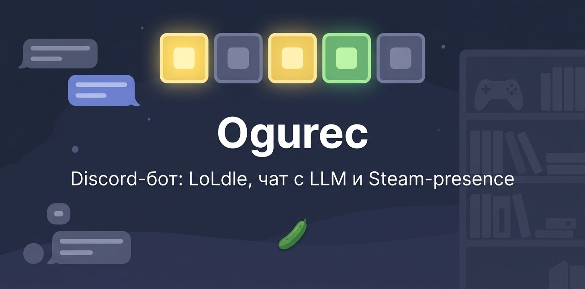

<p align="center">
  
</p>

# Ogurec — Discord-бот для своего сервера: совместный LoLdle, чат с LLM и Steam-presence

<p align="center">
  <a href="#запуск">Запуск</a> • <a href="#loldle">LoLdle</a> • <a href="#чат-и-сервер">Чат</a> • <a href="#команды">Команды</a>
</p>

Ogurec запускает **LoLdle как Activity** и ведёт общее табло сервера. В чате он отвечает через LLM и сам ищет в вебе. Раз в час бот ставит себе игру из Steam-библиотек участников, а по чётным пятницам крутит роль «Ребрендинг».

<p align="center">
  
</p>

## Запуск

<p align="center">
  
</p>

Вам понадобятся Python 3.14+, Discord-приложение с Activity и ключи из [таблицы переменных](#переменные-среды). Шаблон лежит в [`.env.example`](.env.example).

**Docker** — основной путь:

```bash
cp .env.example .env
docker compose up -d
```

Compose берёт образ `ghcr.io/stirk1337/ogurec:latest`. Данные LoLdle, GIF и игровые сессии живут в volume `ogurec-data`.

**Локально:**

```bash
uv sync
uv run ogurec
```

> [!IMPORTANT]
> Compose не публикует порт Activity. Сервер слушает `ACTIVITY_HOST`:`ACTIVITY_PORT`, по умолчанию `127.0.0.1:18089`. Выведите его наружу своим HTTPS-прокси.

> [!NOTE]
> Это бот одной компании, а не универсальный сервис. Списки Discord- и Steam-id участников задаются в `ogurec/config/settings.py`.

## LoLdle

<p align="center">
  
</p>

Кнопка **Играть** открывает Discord Activity. Режимов пять: классика, цитата, умение, эмодзи и сплеш. Прогресс каждого игрока попадает в общее табло канала, а сутки считаются по Парижу.

- В полночь бот фиксирует итоги дня.
- `/loldle` показывает сегодняшнее табло.
- Свою статистику можно сбросить прямо в Activity. Сброс стирает её из Discord, картинок в чате, cookies и localStorage.

## Чат и сервер

<p align="center">
  
</p>

- Отвечает на любое упоминание. Видит текст сообщения, на которое вы ответили reply-ем.
- Иногда встревает в разговор сам.
- Помнит свой разговор в канале. Память сбрасывается после 10 минут тишины или по `/reset_history`.
- Ищет в вебе, когда LLM решает, что без поиска не ответить. Если в сообщении упомянут человек, поиск не запускается.
- Собирает GIF из чата: Klipy, Tenor, Giphy, Discord CDN. Иногда кидает гифку или стикер после ответа.
- Каждое утро в 06:00 (UTC+5) пишет отчёт по играм, в которые заходили участники.

Presence раз в час берёт случайную игру из Steam-библиотек участников. Иногда бот постит её в основной канал вместе с GIF из Klipy. Роль «Ребрендинг» сменяется сама в пятницу чётной ISO-недели в 00:01 (UTC+5), очередь показывает `/rebranding`.

## Команды

| Команда | Что делает |
| --- | --- |
| `/loldle` | сегодняшнее табло LoLdle |
| `/reset_history` | сброс истории LLM в этом канале |
| `/rebranding` | очередь роли «Ребрендинг» |
| `/hello` | приветствие |
| `!sync` | синхронизация slash-команд |
| `!time` | время бота (UTC+5) |

## Как устроен

<p align="center">
  
</p>

Сообщение или нажатие кнопки в Discord приходит в бота. Дальше работают три независимых контура:

1. LoLdle Activity с табло в чате.
2. LLM с памятью разговора и веб-поиском.
3. Steam-presence с игрой из библиотеки.

История чата хранится в памяти и пропадает при рестарте. LoLdle, GIF и игровые сессии пишутся на диск.

## Переменные среды

<details>
<summary>Все переменные из <code>.env</code></summary>

| Переменная | Зачем |
| --- | --- |
| `DISCORD_BOT_TOKEN` | токен бота |
| `DISCORD_CLIENT_ID` | OAuth / LoLdle Activity |
| `DISCORD_CLIENT_SECRET` | обмен кода Activity |
| `GPT_API_KEY` | LLM |
| `API_BASE_URL` | OpenAI-совместимый endpoint (`…/v1/chat/completions`) |
| `LLM_MODEL` | `auto`, `auto:smart` или `auto:fast` |
| `STEAM_API_KEY` | presence из библиотек |
| `KLIPY_API_KEY` | GIF к presence |
| `PREFIX` | префикс текстовых команд, по умолчанию `!` |
| `BOT_CHAT_ID` | служебный канал (ребрендинг) |
| `MAIN_CHAT_ID` | канал presence и утреннего отчёта |
| `ACTIVITY_HOST` / `ACTIVITY_PORT` | где крутится LoLdle |
| `SEARCH_ENABLED` | веб-поиск для чата |

`BOT_CHAT_ID` и `MAIN_CHAT_ID` можно не задавать: тогда останутся значения из настроек.

</details>
