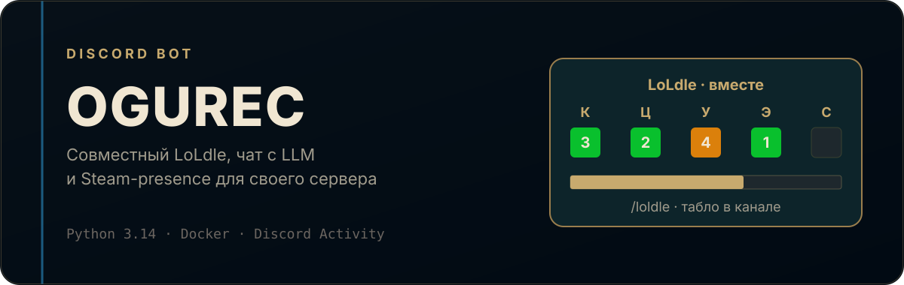
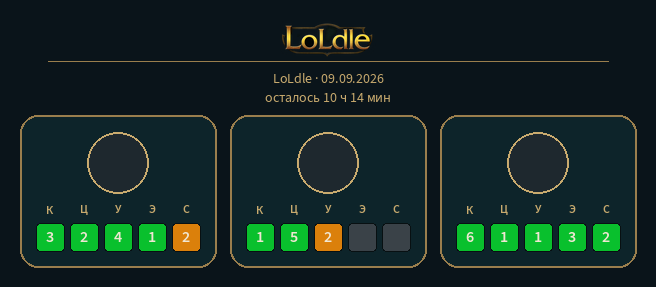
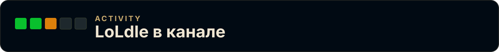
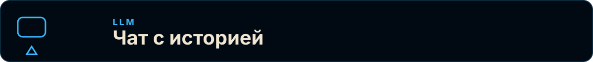
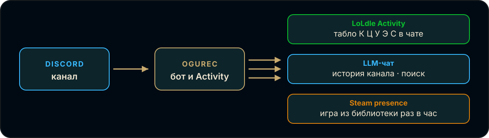
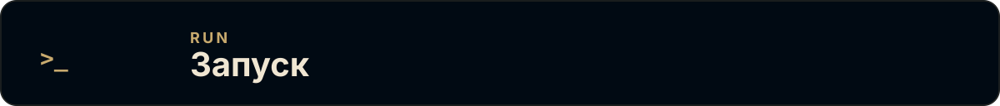

<p align="center">
  
</p>

Discord-бот для своего сервера. Запускает **LoLdle как Activity**, пишет в чат через LLM, раз в час ставит игру из Steam-библиотеки и по чётным пятницам крутит роль «Ребрендинг».

<p align="center">
  
</p>

## LoLdle

<p align="center">
  
</p>

Кнопка **Играть** открывает Discord Activity. Прогресс по пяти режимам (классика, цитата, умение, эмодзи, сплеш) уходит в общее табло канала на парижские сутки. В полночь бот фиксирует итоги. `/loldle` показывает сегодняшний лист. В Activity можно сбросить свою статистику — из Discord, картинок в чате, cookies и localStorage.

## Чат и сервер

<p align="center">
  
</p>

- Отвечает на упоминание (в том числе если фраза заканчивается на `?`, `!` или `.`)
- Иногда отвечает сам, с историей канала (сброс через 10 минут тишины или `/reset_history`)
- Ищет в вебе, если это вопрос и в сообщении нет упоминания человека
- Копит GIF из чата (Klipy, Tenor, Giphy, Discord CDN) и иногда кидает гифку или стикер после ответа
- Утром в 06:00 (UTC+5) пишет отчёт по играм, в которые заходили с сервера

Presence раз в час берёт случайную игру из Steam-библиотек своих людей и иногда постит её в основной канал вместе с GIF из Klipy. Ребрендинг — `/rebranding` и автосмена роли в пятницу чётной ISO-недели в 00:01 UTC+5.

## Как устроен

<p align="center">
  
</p>

Сообщение или кнопка в Discord попадает в бота. Дальше три независимых контура: LoLdle Activity с табло в чате, LLM с историей канала и поиском, Steam-presence с игрой из библиотеки.

## Запуск

<p align="center">
  
</p>

Нужны Python 3.14+, Discord-приложение с Activity и ключи из таблицы ниже. Шаблон — [`.env.example`](.env.example). `BOT_CHAT_ID` и `MAIN_CHAT_ID` можно не задавать, если оставляете значения из настроек.

**Docker** — основной путь. В корне нужен `.env`, затем:

```bash
cp .env.example .env
docker compose up -d
```

Образ: `ghcr.io/stirk1337/ogurec:latest`. Данные (LoLdle, GIF, сессии игр) лежат в volume `ogurec-data`. Compose порты Activity не публикует: сервер слушает `ACTIVITY_HOST`:`ACTIVITY_PORT` (по умолчанию `127.0.0.1:18089`), наружу его нужно вывести своим HTTPS-прокси.

**Локально:**

```bash
uv sync
uv run ogurec
```

### Переменные среды

| Переменная | Зачем |
| --- | --- |
| `DISCORD_BOT_TOKEN` | токен бота |
| `DISCORD_CLIENT_ID` | OAuth / LoLdle Activity |
| `DISCORD_CLIENT_SECRET` | обмен кода Activity |
| `GPT_API_KEY` | LLM |
| `API_BASE_URL` | OpenAI-совместимый endpoint (`…/v1/chat/completions`) |
| `LLM_MODEL` | `auto`, `auto:smart` или `auto:fast` |
| `STEAM_API_KEY` | presence из библиотек |
| `KLIPY_API_KEY` | GIF к presence |
| `PREFIX` | префикс текстовых команд, по умолчанию `!` |
| `BOT_CHAT_ID` | служебный канал (ребрендинг) |
| `MAIN_CHAT_ID` | канал presence и утреннего отчёта |
| `ACTIVITY_HOST` / `ACTIVITY_PORT` | где крутится LoLdle |
| `SEARCH_ENABLED` | веб-поиск для чата |

### Команды

| Команда | Что делает |
| --- | --- |
| `/loldle` | сегодняшнее табло LoLdle |
| `/reset_history` | сброс истории LLM в этом канале |
| `/rebranding` | очередь роли «Ребрендинг» |
| `/hello` | приветствие |
| `!sync` | синхронизация slash-команд |
| `!time` | время бота (UTC+5) |

История чата живёт в памяти и пропадает при рестарте. LoLdle, GIF и игровые сессии пишутся на диск. Это бот одной тусовки: списки Steam/Discord-id задаются в настройках, не универсальный SaaS.
